# CTF Agent Codex

[English](README.md) | [한국어](README.ko.md)

[](https://github.com/Clotilde030603/ctf-agent-codex/actions/workflows/ci.yml)


**문제 URL 입력부터 분석, 풀이, 플래그 검증·제출, Accepted 증적 캡처, 재현 가능한 Write-up 작성까지 자동화하는 Codex 기반 CTF 에이전트입니다.**

> 프로젝트 상태: **실행 가능한 experimental vertical slice**. 기본 `codex` 경로는 Codex planner와 통제된 model worker lane을 결정론적 workflow에 연결합니다. CTFd/rCTF adapter, 검증 gate, 증적, resume, 로컬 fixture는 test-backed 상태입니다. 깊은 pwn/rev 지원과 live platform 호환성은 아직 experimental입니다.

사용자가 얻게 되는 결과:

- URL 하나로 문제 정보 수집, 인증 세션 재사용, 첨부파일 다운로드
- 재귀적 triage, category 분류, Codex 기반 가설 계획, 최대 3개 격리 worker lane
- 제출 전 provenance 기반 플래그 검증
- durable submission budget을 적용한 Accepted/Wrong 판독
- `solve.py`, 증적 이미지, event ledger, `writeup.md`
- SQLite checkpoint와 `ctf-agent resume`

```bash
git clone https://github.com/Clotilde030603/ctf-agent-codex.git
cd ctf-agent-codex
python3.12 -m venv .venv
source .venv/bin/activate
python -m pip install -e ".[browser]"
playwright install chromium
docker version  # 기본 재현을 위해 daemon이 실행 중이어야 함
```

```bash
ctf-agent solve "https://ctf.example.com/challenges/123" --auto-submit --writeup
```

## CTF Agent Codex란?

명시적으로 허가된 CTF 대회, 퇴역 문제, 워게임, 실습 환경을 위한 로컬 Python 애플리케이션입니다. 사용자가 문제 URL 하나를 입력하면 결정론적 controller가 인증, 수집, artifact 분석, 가설 계획, solver 실행, 후보 검증, 제출 전 clean reproduction, 선택적 자동 제출, 복구 가능한 증적·Write-up 생성을 순서대로 수행합니다.

모델은 workflow 상태를 임의로 바꾸지 못합니다. 상태 전이는 Python이 통제하며 resume은 DB의 검증된 비밀 제외 설정 snapshot을 먼저 복원합니다.

```text
AUTHENTICATE -> INGEST -> TRIAGE -> PLAN -> SOLVE -> VERIFY
-> REPRODUCE -> SUBMIT -> EVIDENCE_PENDING -> WRITEUP_PENDING -> DONE
```

따라서 제출 결정, Wrong 처리, resume, 증적 생성 과정을 사후에 확인할 수 있습니다.

## 왜 이 프로젝트인가?

일부 CTF AI agent는 모델이 flag처럼 보이는 문자열을 출력하면 작업을 끝냅니다. 이 프로젝트는 그 값을 신뢰하지 않는 후보로 취급합니다. 후보가 어디에서 발견됐는지 기록하고, sample과 placeholder를 제거하고, solver를 새 프로세스에서 다시 실행하고, 과거 Wrong 기록과 submission budget을 확인한 뒤에만 제출합니다.

또한 채팅 기록만 남기는 대신 재현 가능한 solver, 구조화된 분석, checkpoint, 증적, 실제 기록 기반 Write-up을 보존합니다.

## 주요 기능

| 기능 | 상태 | 현재 동작 |
| --- | --- | --- |
| URL 기반 문제 수집 | Experimental | CTFd API 우선, generic HTML fallback |
| 세션 재사용과 브라우저 로그인 | Experimental | Playwright storage state 재사용, 최초 CTFd 로그인 시 Chromium 실행 |
| 첨부파일 다운로드 | Implemented | scope 검증, filename/path traversal 방어 |
| 재귀적 triage | Implemented | hash, MIME/magic hint, entropy, strings, indicator, 안전한 zip/tar 해제, 선택적 도구 |
| category 분류 | Experimental | web, pwn, rev, crypto, forensics, misc, mixed signal 분류 |
| 가설 scheduler | Implemented | 최대 3개의 구조화된 비동기 lane |
| 기본 solver | Experimental | artifact에서 직접 발견되는 flag signal을 `solve.py`로 재현 |
| category별 solver | Experimental | Crypto, forensics/misc, static web specialist가 model lane 전에 실행됨. pwn/rev는 model worker와 선택 도구에 의존 |
| Codex backend | Experimental | 비동기 CLI adapter, schema 검증, planner 호출, 통제된 worker 호출이 `backend=codex`에 연결됨 |
| Claude backend | Stub | 테스트 가능한 stub만 존재하며 실제 Claude 연결 없음 |
| 플래그 검증 게이트 | Implemented | format, placeholder, provenance, clean replay, negative control, blind Codex 재도출, Wrong 이력, budget 검사 |
| 자동 제출 | Experimental | CTFd 제출·판독, durable pending attempt, 중복 제출 방지 |
| 증적과 Write-up | Experimental | 이미지 3종, 정제된 transcript, manifest, Markdown, HTML, provenance JSON 생성·검수 |
| Resume | Implemented | SQLite 상태와 append-only JSONL event |
| Benchmark | Implemented | offline YAML command fixture와 시간·재현 지표 |

## 동작 방식

```mermaid
flowchart LR
    A[Challenge URL] --> B[Authentication]
    B --> C[Challenge Collection]
    C --> D[Recursive Triage]
    D --> E[Hypothesis Planning]
    E --> F[Specialist Solvers]
    F --> G[Flag Verification]
    G --> H[Automatic Submission]
    H --> I[Accepted Evidence]
    I --> J[Clean Reproduction]
    J --> K[Reproducible Write-up]
```



복구 가능한 SOLVE/VERIFY 실패는 PLAN 또는 SOLVE로 돌아갑니다. Wrong 후보는 저장되어 다시 제출되지 않습니다. 제출 직후 프로세스가 중단돼 결과가 불확실하면 플랫폼의 solved 상태로 pending attempt를 확인하거나 fail-closed 하며, 동일 값을 무조건 재제출하지 않습니다.

## 지원 CTF Category

분석 지원과 심화 자율 풀이 지원을 구분해야 합니다.

| Category | 분석 상태 | 자율 풀이 상태 | 주요 도구 |
| --- | --- | --- | --- |
| Web | Experimental | 정적 source/asset 분석, model-worker fallback, host-scoped HTTP action | `httpx`, Playwright, route/URL/session indicator |
| Pwn | Experimental | model-worker 전용. 깊은 exploit 작성은 production-grade가 아님 | `file`, `strings`, 선택적 `checksec`; pwntools/GDB/ROP 도구는 환경에 별도 설치 필요 |
| Reverse engineering | Experimental | model-worker 전용. 깊은 reversing은 production-grade가 아님 | import/strings/language signal; binary 도구는 환경에 별도 설치 필요 |
| Crypto math | Experimental | deterministic base64/hex/single-byte XOR 복구와 model-worker fallback | Python; PyCryptodome/z3/Sage는 agent가 설치하지 않는 선택 도구 |
| Crypto binary | Experimental | deterministic encoding/XOR 복구와 model-worker fallback | Python과 보존 artifact |
| Forensics | Experimental | strings, metadata/tool output, nested extraction, PNG text chunk 분석과 model-worker fallback | metadata 중심 triage, archive provenance, 선택적 `exiftool`/`binwalk` |
| Misc / mixed | Experimental | deterministic artifact signal과 model-worker fallback | 가중치 기반 복수 category 분류 |

분류할 수 있다는 것이 해당 category의 모든 문제를 자율적으로 해결할 수 있다는 의미는 아닙니다.

## 지원 플랫폼

| 플랫폼 | 상태 | 인증 | 수집 | 자동 제출 |
| --- | --- | --- | --- | --- |
| CTFd | Experimental, integration-tested | API 세션 확인, 선택적 Playwright 로그인·재사용 | API 우선, HTML fallback | 지원 |
| Generic HTML | Experimental | 공개/basic HTTP fetch, custom session은 코드에서 주입해야 함 | 제목, 설명, link, flag hint | generic 제출 endpoint 없음 |
| rCTF | Experimental, fake integration-tested | `/api/v1/auth/test` 세션 확인 | `/api/v1` 또는 `/api/v2` challenge list와 attachment mapping | `/api/v1/challs/<id>/submit` 경유 지원 |

테스트 suite는 fake 및 `httpx.MockTransport` CTFd fixture를 사용합니다. 실제 계정, cookie, 활성 대회 flag는 포함하지 않습니다.

## 현재 프로젝트 상태

- Release: `0.1.0`
- 전체 성숙도: **Experimental**
- 자동화 테스트: 현재 branch는 planner/worker, 검증, CTFd/rCTF adapter, 증적/Write-up, benchmark metric에 대한 unit/fake-integration coverage 포함
- 검증된 흐름: fake/Mock CTFd 수집 → triage → 후보 → 검증 → Accepted → 증적 → Write-up → 재현
- 아직 검증하지 않은 범위: 모든 CTFd/rCTF theme/version, 실제 MFA provider, native Windows, 심화 exploit 문제

마일스톤 기록은 [docs/implementation-log.md](docs/implementation-log.md)를 참고하십시오.

## 요구사항

필수:

- macOS 또는 Linux. WSL2는 동작할 것으로 예상하지만 지속적으로 테스트하지 않습니다.
- 고정 dependency가 지원하는 Python 3.12 이상
- Git
- 기본 clean reproduction 게이트를 위한 실행 중인 Docker daemon
- 대상 CTF 자동화에 대한 명시적 권한

브라우저 인증과 PNG 증적에 필요:

- Playwright Chromium

model 기반 lane에 필요:

- 설치 및 로그인된 Codex CLI

선택 도구 `file`, `strings`, `checksec`, `exiftool`, `binwalk`는 실행 시 탐지합니다. 없으면 자동 설치하지 않고 triage의 missing capability로 기록합니다.

Native Windows는 테스트하지 않았습니다. Windows에서는 WSL2 사용을 권장합니다.

## 설치

### macOS, Linux, WSL2

```bash
git clone https://github.com/Clotilde030603/ctf-agent-codex.git
cd ctf-agent-codex

python3.12 -m venv .venv
source .venv/bin/activate

python -m pip install --upgrade pip
python -m pip install -e ".[browser]"
playwright install chromium
```

운영체제에 맞는 Docker를 설치하고 daemon을 시작한 뒤 확인합니다.

```bash
python --version
docker version
ctf-agent --help
```

개발 dependency까지 설치하려면 `.[dev,browser]`를 사용합니다.

checkout에서 격리된 CLI로 설치하려면 다음을 사용합니다.

```bash
pipx install .
ctf-agent --help
```

Linux와 macOS를 CI/로컬 기준으로 지원합니다. Windows에서는 WSL2를 권장하며
native Windows는 이 alpha에서 지원하지 않습니다.

## Codex 설정

프로젝트에는 테스트된 비동기 Codex CLI backend가 있습니다. 기본 `CTF_BACKEND=codex`에서는 `ModelHypothesisPlanner`를 호출하고, deterministic preflight 결과를 context로 전달한 통제된 model-worker lane을 항상 실행하며, 제출 전에 별도의 blind verifier model 재도출을 요구합니다. 결정론적 경로만 사용하려면 `CTF_BACKEND=static`을 명시하십시오.

[OpenAI 공식 Codex CLI 문서](https://learn.chatgpt.com/docs/codex/cli)에 따르면 macOS/Linux에서 다음 명령으로 설치·업데이트할 수 있습니다.

```bash
curl -fsSL https://chatgpt.com/codex/install.sh | sh
```

설치 후 다음 명령을 실행합니다.

```bash
codex
```

최초 실행에서는 **Sign in with ChatGPT** 또는 Codex가 제공하는 다른 로그인 방법을 선택합니다.

```bash
codex --version
codex
```

이 저장소는 Codex 자격증명을 저장하지 않습니다. 인증은 Codex CLI가 관리합니다. `CTF_CODEX_BINARY`는 planner와 worker model 호출에 사용할 executable을 지정합니다.

## 최초 CTF 플랫폼 인증

CTF 플랫폼 인증은 Codex 인증과 별개입니다.

CTFd의 `/api/v1/users/me` 세션 확인이 실패하면:

1. storage state가 없을 때 Playwright가 보이는 Chromium을 실행합니다.
2. 열린 CTF 플랫폼 페이지에서 로그인합니다.
3. MFA/CAPTCHA가 있다면 해당 브라우저에서 최초 한 번 처리합니다.
4. agent는 logout/authenticated selector 또는 `/login`을 벗어난 뒤 생긴 session cookie를 감지합니다.
5. 인증 감지 후 storage state를 `0600` 권한으로 저장합니다.
6. HTTP API 세션이 browser cookie를 가져오고 Enter 입력 없이 자동화를 계속합니다.

기본 세션 위치:

```text
runs/.sessions/<challenge-host>.json
```

`CTF_BROWSER_STORAGE_STATE`로 변경할 수 있습니다. `runs/`와 일반적인 session/profile 파일은 Git에서 제외됩니다. 그러나 storage state에는 살아 있는 cookie가 포함될 수 있으므로 password처럼 취급해야 합니다. issue에 첨부하거나 commit하지 마십시오.

세션 파일은 남아 있지만 만료된 경우 해당 host의 storage-state 파일만 삭제하고 다시 실행하여 보이는 로그인 browser를 여십시오.

## Quick Start

명시적으로 허가된 CTFd 문제 URL을 사용합니다.

```bash
ctf-agent solve "https://ctf.example.com/challenges/123" \
  --auto-submit \
  --writeup
```

`--auto-submit`은 대회 규정이 자동 제출을 허용할 때만 사용하십시오. `--auto-submit`을 생략하거나 `--dry-run`을 사용하면 검증 후 `READY` 상태에서 멈추고 실제 제출 대신 private 검토용 `verified-candidate.json`을 기록할 수 있습니다.

## 사용법

실제 CLI 계약은 로컬 `--help`가 기준입니다.

```bash
ctf-agent --help
ctf-agent solve --help
ctf-agent resume --help
ctf-agent retry-evidence --help
ctf-agent doctor --help
ctf-agent benchmark --help
```

풀이, 제출, Write-up 생성:

```bash
ctf-agent solve "<challenge-url>" --auto-submit --writeup
```

production model 경로와 사용자 제공 model identifier 지정:

```bash
ctf-agent solve "<challenge-url>" \
  --backend codex \
  --planner-model "<planner-model>" \
  --solver-model "<solver-model>" \
  --reviewer-model "<reviewer-model>" \
  --planner-effort medium \
  --solver-effort xhigh \
  --reviewer-effort high \
  --max-workers 3 \
  --auto-submit \
  --writeup
```

외부 제출 없이 같은 workflow 실행:

```bash
ctf-agent solve "<challenge-url>" \
  --backend codex \
  --dry-run \
  --writeup
```

Accepted 증적과 재현은 수행하되 Markdown 문서는 생략:

```bash
ctf-agent solve "<challenge-url>" --auto-submit --no-writeup
```

원본 flag를 노출하지 않는 공개용 Write-up 파일 생성:

```bash
ctf-agent solve "<challenge-url>" \
  --auto-submit \
  --writeup \
  --redact-flag
```

다른 위치에 실행 결과 저장:

```bash
ctf-agent solve "<challenge-url>" --auto-submit --runs-dir /path/to/ctf-runs
```

명시적으로 허가된 localhost/private-address 실습 환경:

```bash
ctf-agent solve "http://127.0.0.1:8000/challenges/7" \
  --auto-submit \
  --allow-private-host
```

Docker를 사용할 수 없을 때만 약한 host 재현 모드를 명시적으로 선택:

```bash
ctf-agent solve "<challenge-url>" \
  --auto-submit \
  --allow-local-reproduction
```

이 옵션은 host에서 `python3 -I solve.py`를 실행하며 clean Docker reproduction과 동등하지 않습니다.

원래 설정 snapshot을 복원하되 특정 역할만 override:

```bash
ctf-agent resume <run-id> --solver-model "<model>" --solver-effort xhigh
```

이미 Accepted인 run의 누락 증적을 재제출 없이 다시 캡처:

```bash
ctf-agent retry-evidence <run-id>
```

production 도구 이미지와 로컬 runtime 점검:

```bash
docker build -t ctf-agent-codex-tools:0.1.0 -f docker/ctf-tools/Dockerfile .
ctf-agent doctor
```

현재 `status`, `--session`, `--no-submit` option은 없습니다. 제출하지 않는 실행에는 `--dry-run`을 사용하고, 로컬 기준은 `--help`를 따르십시오.

## 자동 플래그 검증과 제출

`--auto-submit`은 처음 발견한 flag-like 문자열을 곧바로 제출하지 않습니다. 후보는 다음 검사를 통과해야 합니다.

1. 문제 flag format policy 일치
2. sample/placeholder 제거
3. artifact, 위치, derivation, solver command provenance
4. 새 프로세스에서 `solve.py` replay
5. 데이터 의존성 negative control과 별도 blind reviewer model
6. 과거 Wrong 후보 차단
7. submission budget
8. 외부 요청 전 durable pending-attempt 예약

Accepted, Already Solved, Wrong, rate-limited, unknown 결과를 구분합니다. 제출 직후 중단돼도 pending attempt를 플랫폼 상태로 확인하거나 fail-closed 하므로 동일 값을 무조건 다시 제출하지 않습니다.

자동 제출에는 대회 penalty가 있을 수 있습니다. `--auto-submit`을 사용하기 전에 AI와 자동화가 허용되는지 확인하십시오.

## 증적 캡처

Accepted 이후 다음 파일이 필요합니다.

- `01-challenge.png`: 문제 내용
- `02-exploit-proof.png`: 최종 solver 출력
- `03-accepted.png`: Accepted/Solved 화면
- `02-exploit-proof.html`: 민감정보를 정제한 terminal transcript
- `manifest.json`: SHA-256, label, 생성 시각, source, redaction metadata

브라우저는 전체 desktop이 아니라 문제 내용 영역을 캡처합니다. terminal renderer는 일반적인 cookie, bearer token, API key, CSRF token, password, session 값을 정제합니다. 개별 screenshot 실패는 성공한 증적을 보존하고 sanitized HTML/API verdict fallback과 manifest failure를 남깁니다. run은 `DONE_WITH_WARNINGS`로 끝날 수 있으며 `retry-evidence`로 다시 캡처할 수 있습니다.

## 자동 Write-up 생성

`writeup.md`는 모델 대화 기억이 아니라 저장된 사실로 생성합니다. 입력은 `challenge.json`, `triage.json`, hypotheses, verified event, `solve.py`, submission 결과, evidence manifest입니다.

deterministic reviewer가 필수 heading, evidence hash/존재 여부, 근거 없는 flag-like 값, secret-like material을 확인합니다. `--no-writeup`으로 Markdown 생성을 건너뛸 수 있습니다.

## 중단된 실행 재개

```bash
ctf-agent resume <run-id>
```

controller는 `state.db`에서 마지막 상태를 읽고 계속합니다. 완료 task는 checkpoint되며 append-only 기록은 `events.jsonl`에 남습니다.

credential query가 포함된 challenge URL은 redacted 상태로 저장됩니다. 이런 실행을 재개할 때 원본 URL을 메모리에만 다시 제공합니다.

```bash
ctf-agent resume <run-id> \
  --challenge-url "https://ctf.example/challenge?token=..."
```

처음 실행에서 custom run directory를 사용했다면 resume에도 같은 값을 지정합니다.

```bash
ctf-agent resume <run-id> --runs-dir /path/to/ctf-runs
```

## 출력 디렉터리

현재 실제 경로는 challenge host, URL path, run ID를 사용합니다.

```text
runs/<challenge-host>/<challenge-path>-<run-id>/
├── challenge.json
├── state.db
├── triage.json
├── hypotheses.json
├── events.jsonl
├── files/
├── artifacts/
│   └── specialist-results.json
├── solve.py
├── requirements.txt
├── evidence/
│   ├── 01-challenge.png
│   ├── 02-exploit-proof.html
│   ├── 02-exploit-proof.png
│   ├── 03-accepted.png
│   └── manifest.json
├── writeup.md
├── writeup.html
├── provenance.json
└── verified-candidate.json  # READY/manual path에서만 생성
```

중요 파일:

| 파일 | 역할 |
| --- | --- |
| `solve.py` | 보존된 문제 파일에서 결과를 재현하는 최종 solver |
| `writeup.md`, `writeup.html` | 실제 기록을 바탕으로 생성한 풀이 문서 |
| `provenance.json` | Write-up 입력과 생성 output hash |
| `evidence/` | 문제·exploit·Accepted 증적과 무결성 manifest |
| `state.db` | resume를 위한 상태, checkpoint, rejected candidate, submission attempt |
| `events.jsonl` | 상태, 검증, 제출, 재현 event의 append-only 기록 |
| `triage.json` | 재귀 파일 목록, indicator, tool 결과, category 분류 |
| `artifacts/` | raw tool output, extraction, specialist 결과 |

실제 run directory에는 flag와 대회 비공개 정보가 있을 수 있습니다. 검토 없이 공개하지 마십시오.

## 설정

tracked example을 복사합니다.

```bash
cp .env.example .env
```

`pydantic-settings`가 `CTF_` prefix의 `.env`를 읽습니다.

| 변수 | 기본값 | 영향과 trade-off |
| --- | --- | --- |
| `CTF_RUNS_DIR` | `runs` | run/session root |
| `CTF_REQUEST_TIMEOUT_SECONDS` | `20` | scoped platform session에 사용하는 HTTP timeout |
| `CTF_TOOL_TIMEOUT_SECONDS` | `30` | triage 도구와 solver replay timeout, browser/terminal capture는 별도 30초 기본값 사용 |
| `CTF_RETRY_BUDGET` | `2` | scoped platform session에 사용하는 HTTP retry budget |
| `CTF_SUBMISSION_BUDGET` | `1` | run당 durable 제출 시도 한도 |
| `CTF_MAX_HYPOTHESES` | `3` | planner cap. 최대 3개 가설만 schedule |
| `CTF_MAX_STATE_STEPS` | `100` | 무한 재계획 loop 방지 |
| `CTF_MAX_EXTRACTION_DEPTH` | `3` | archive recursion 한도 |
| `CTF_MAX_EXTRACTED_BYTES` | `268435456` | 총 extraction 256 MiB 한도 |
| `CTF_RATE_LIMIT_PER_SECOND` | `2` | scoped platform session에 사용하는 request pacing |
| `CTF_BROWSER_STORAGE_STATE` | unset | Playwright storage-state 위치 |
| `CTF_ALLOW_PRIVATE_HOSTS` | `false` | private/loopback target 허용, 허가된 lab에서만 사용 |
| `CTF_ALLOW_LOCAL_REPRODUCTION` | `false` | Docker 대신 약한 host `python -I` 사용 |
| `CTF_APPROVE_STATIC_SUBMISSION` | `false` | static backend 자동 제출에 필요한 명시적 operator 승인 |
| `CTF_REDACT_FLAG` | `false` | 생성 Markdown, HTML, provenance에서 검증된 flag redaction |
| `CTF_DOCKER_IMAGE` | `ctf-agent-codex-tools:0.1.0` | worker와 clean replay용 versioned non-root image |

`.env`는 Git에서 제외됩니다. `.env.example`에는 실제 flag, cookie, password, API key를 넣지 마십시오.

## 모델 설정

| 변수 | 기본값 |
| --- | --- |
| `CTF_BACKEND` | `codex` |
| `CTF_PLANNER_MODEL` | `gpt-5.6-sol` |
| `CTF_SOLVER_MODEL` | `gpt-5.6-sol` |
| `CTF_VERIFIER_MODEL` | `gpt-5.6-sol` |
| `CTF_PLANNER_EFFORT` | `high` |
| `CTF_SOLVER_EFFORT` | `xhigh` |
| `CTF_VERIFIER_EFFORT` | `high` |
| `CTF_CODEX_BINARY` | `codex` |
| `CTF_MODEL_TIMEOUT_SECONDS` | `180` |
| `CTF_MODEL_CALL_BUDGET` | `20` |
| `CTF_MAX_MODEL_CONTEXT_BYTES` | `524288` |
| `CTF_MAX_WORKERS` | `3` |
| `CTF_ALLOW_STATIC_FALLBACK` | `false` |
| `CTF_TOTAL_RUN_TIMEOUT_SECONDS` | `3600` |
| `CTF_WORKER_MAX_STEPS` | `12` |
| `CTF_WORKER_MAX_COMMANDS` | `8` |
| `CTF_WORKER_MAX_HTTP_REQUESTS` | `8` |
| `CTF_WORKER_WALL_TIME_SECONDS` | `600` |
| `CTF_WORKER_NO_PROGRESS_LIMIT` | `3` |

Planner, solver, verifier model 이름은 사용자가 지정한 문자열 그대로 Codex CLI에 전달됩니다. 이 agent는 특정 계정에서 특정 model 또는 reasoning effort를 사용할 수 있다고 가정하지 않습니다. 일반적인 운용 정책은 어려운 web/pwn/rev lane에 보안 지향 model을, orchestration/triage/write-up 검토에는 일반 Codex model을 지정하는 것입니다. 자세한 내용은 [docs/model-routing.md](docs/model-routing.md)를 참고하십시오.

Model worker는 model call 수, command report, wall-clock budget을 기록합니다. token/cost accounting은 backend 지원 여부에 따라 달라지며 이 release에서 보장하지 않습니다.

Claude adapter는 테스트 stub입니다. 이 release에는 실제 Claude 인증/API 호출이 없습니다.

## 보안 및 Scope 제한

명시적으로 허가된 CTF, 퇴역 문제, 워게임, 실습 환경에서만 사용하십시오.

- 원본 challenge host가 초기 network scope입니다.
- attachment와 remote service host는 challenge data에 선언된 뒤에만 허용합니다.
- redirect target을 다시 검증하며 전체 인터넷 scan을 금지합니다.
- private/loopback host는 `--allow-private-host` 없이는 차단합니다.
- 지원하는 zip/tar extraction에 traversal, depth, file count, total extracted-size 한도를 적용합니다. `max_file_size`는 scan read 한도이며 archive member별 extraction 한도가 아닙니다.
- Docker replay는 CPU, memory, PID, read-only filesystem, timeout, no-network 제한을 사용합니다.
- signed URL token 등 query secret은 SQLite/JSONL 저장 전에 redaction합니다.
- browser storage, cookie, `.env`, `runs/`, database는 Git에 올리지 않습니다.
- 외부 skill과 executable dependency는 검토해야 하며 runtime에 자동 설치하지 않습니다.

자동 제출 전에 대회가 AI, 자동 solver, 자동 flag 제출을 허용하는지 확인할 책임은 사용자에게 있습니다.

[docs/security-model.md](docs/security-model.md), [docs/security.md](docs/security.md), [docs/verification.md](docs/verification.md)를 함께 참고하십시오.

## 문제 해결

### `codex` 명령을 찾을 수 없음

- 증상: model backend가 executable 없음 오류를 표시합니다.
- 확인: `command -v codex && codex --version`
- 해결: [OpenAI 공식 CLI 문서](https://developers.openai.com/codex/cli)로 설치하고 shell을 다시 연 뒤 custom `CTF_CODEX_BINARY`를 확인합니다.

### Codex 인증 실패

- 확인: `codex`를 대화형으로 실행하여 로그인 오류를 확인합니다.
- 해결: Codex가 제공하는 로그인 방법을 완료합니다. 이 프로젝트는 Codex 자격증명을 관리하지 않습니다.

### Playwright 또는 Chromium 없음

- 증상: `BrowserUnavailable` 또는 screenshot 실패
- 확인: `python -c "import playwright"`
- 해결: `python -m pip install -e ".[browser]"` 후 `playwright install chromium`

### 로그인 browser가 열리지 않음

- 원인: 만료된 storage-state 파일이 있어 headless 재사용을 시도할 수 있습니다.
- 확인: `runs/.sessions/` 또는 `CTF_BROWSER_STORAGE_STATE`
- 해결: 해당 host의 storage-state 파일만 삭제하고 재실행합니다.

### 세션 만료

- 증상: `/api/v1/users/me`가 계속 unauthenticated이거나 로그인 timeout
- 해결: 해당 storage-state를 삭제하고 다시 로그인합니다. 파일을 공유하지 마십시오.

### Challenge parsing 실패

- 확인: URL과 CTFd `/api/v1/challenges/<id>` 제공 여부
- 해결: 지원 플랫폼인지 확인합니다. Generic HTML parsing은 제한적이며 JavaScript-only page에는 adapter 작업이 필요할 수 있습니다.

### CTFd가 아닌 플랫폼

- 증상: 불완전한 generic 수집 또는 제출 불가
- 해결: auto-detection이 `rctf` 또는 `generic` 중 무엇을 선택했는지 확인합니다. rCTF는 experimental API adapter가 있으며, generic HTML은 내용과 attachment를 수집하지만 제출 endpoint를 추측하지 않습니다.

### Docker daemon 오류

- 확인: `ctf-agent doctor`를 실행합니다. Docker CLI만 있고 daemon이 꺼진 상태는 실패로 판정합니다.
- 해결: daemon을 시작하고 `docker/ctf-tools/Dockerfile`을 빌드합니다. `--allow-local-reproduction`은 명시적인 약한 fallback입니다.

### CTF 도구 없음

- 증상: `missing_capabilities`에 `checksec`, `exiftool`, `binwalk` 표시
- 해결: 신뢰할 수 있는 출처에서 설치하거나 축소된 triage로 진행합니다. agent가 자동 설치하지 않습니다.

### Solver timeout

- 확인: `events.jsonl`과 tool stderr artifact
- 해결: 실제 진전과 안전성을 확인한 뒤에만 `CTF_TOOL_TIMEOUT_SECONDS`를 늘립니다.

### Flag를 발견했지만 검증 실패

- 확인: `flag.verification_failed` event, provenance, flag policy, fresh replay output
- 해결: `solve.py`를 수정하거나 새로운 근거 기반 후보를 생성합니다. 검증 gate를 우회하지 마십시오.

### 플랫폼 제출 실패 또는 rate limit

- 확인: 최신 `flag.submitted` event와 CTF 플랫폼 응답
- 해결: **CTF 플랫폼** rate limit을 기다리고 budget을 확인한 뒤 resume합니다. GitHub API limit과 무관합니다.

### Resume 실패

- 확인: 정확한 run ID와 동일한 `--runs-dir`
- 해결: run directory를 복원합니다. 원 URL에 token이 있었다면 `--challenge-url`도 전달합니다.

### 증적 이미지 없음

- 확인: Playwright/Chromium, 인증된 storage state, 플랫폼 selector
- 해결: 인증을 갱신하고 resume합니다. 3개 증적을 생성할 수 없으면 workflow가 의도적으로 fail-closed 합니다.

## 개발

```bash
git clone https://github.com/Clotilde030603/ctf-agent-codex.git
cd ctf-agent-codex
python3.12 -m venv .venv
source .venv/bin/activate
python -m pip install -e ".[dev,browser]"
playwright install chromium
```

새 플랫폼은 `src/ctf_agent/platforms/base.py`의 protocol을 구현하고 `HostScope`, parsing, verdict, redirect, integration test를 추가합니다.

새 specialist는 `src/ctf_agent/specialists/base.py`의 `Specialist`를 구현합니다. 구조화된 `SpecialistResult`만 반환하고 artifact provenance를 보존하며 specialist 내부에서 제출하지 않습니다.

## 테스트

```bash
# 전체 suite
pytest

# 플랫폼 및 end-to-end fixture
pytest tests/test_platform.py tests/test_integration_ctfd.py tests/test_e2e.py

# lint와 strict type check
ruff check src tests evals
mypy src/ctf_agent

# import/bytecode smoke check
python -m compileall -q src tests evals
```

fixture에는 fake/retired data만 사용하십시오. live cookie, 활성 private flag, 계정 자격증명을 추가하지 마십시오.

## Benchmark

포함된 retired fixture 실행:

```bash
ctf-agent benchmark evals/manifest.yaml
```

```yaml
repeat_runs: 3
timeout_seconds: 30
total_budget_seconds: 300
challenges:
  - id: local-retired-warmup
    category: warmup
    difficulty: retired
    source: self-authored
    license: MIT
    retired: true
    authorized_for_benchmark: true
    expected_solver_capability: deterministic-fixture
    command: [python3, fixtures/retired-warmup/solve.py]
    expected_flag: flag{retired_fixture_only}
    clean_mode: local
```

runner는 agent/version/commit/model identity를 기록하고 명시적으로 허가되지 않은 fixture를 거부하며 deterministic fixture와 model-solving fixture를 분리합니다. 공식 aggregate metric은 명시적 event, command 실행, clean replay에서 계산합니다. Fixture metric은 `self_reported_metrics`로 별도 보존되어 공식 aggregate를 변경하지 않습니다.

이 내용은 별도의 clean-environment replay를 수행하지는 않습니다라고 적힌 예전 README 설명을 대체합니다. 현재 runner는 `clean_replay`가 활성화되어 있으면 clean replay를 수행합니다. token과 금액 기준 cost는 이 release의 authoritative benchmark metric이 아닙니다.

## Roadmap

- [x] 결정론적 상태 머신과 SQLite/JSONL resume
- [x] scope 제한 CTFd API 수집과 안전한 첨부파일 다운로드
- [x] recursive triage와 category 분류
- [x] hypothesis scheduler와 structured specialist result
- [x] provenance 검증과 submission budget
- [x] crash-safe CTFd 제출과 verdict parsing
- [x] evidence manifest, sanitizer, Write-up 생성
- [x] fake/Mock CTFd E2E와 benchmark fixture
- [x] model 기반 Codex planner와 통제된 solver worker를 기본 workflow에 연결
- [x] experimental crypto, forensics/misc, static web specialist
- [x] experimental rCTF API 인증, 수집, attachment, 제출, pending verdict 확인
- [ ] production-grade pwn/rev deep exploit 지원
- [ ] 다양한 live CTFd/rCTF version/theme 검증
- [ ] 실제 플랫폼 compatibility matrix와 selector profile
- [ ] remote-service fresh replay verification
- [ ] production Claude backend
- [ ] backend가 제공하는 token/cost accounting을 benchmark report에 반영
- [ ] native Windows 검증

## 기여

1. platform/category/bug/capability를 설명하는 issue를 작성합니다.
2. 정제된 log, 관련 state, 재현 단계, 기대 동작을 포함합니다.
3. cookie, storage state, API key, 실제 credential, 활성 flag, 검토하지 않은 run directory를 올리지 마십시오.
4. 작은 변경과 focused test를 선호합니다.
5. PR 전에 pytest, Ruff, mypy, benchmark를 실행합니다.
6. scope restriction, deterministic transition, verification gate를 보존합니다.

제출 안전성을 약화하거나 network scope를 조용히 넓히거나 검토하지 않은 runtime installer를 추가하는 PR은 허용하지 않습니다.

## 라이선스

[MIT License](LICENSE)를 적용합니다.

## 면책 고지

이 소프트웨어는 교육 목적과 명시적으로 허가된 보안 대회·실습 환경을 위해 제공됩니다. 제3자 시스템을 테스트할 권한을 부여하지 않습니다. 대상 권한, 대회 규정, AI/자동화 정책, 제출 penalty, 도구로 수행한 모든 작업의 책임은 사용자에게 있습니다. 본 소프트웨어는 experimental이며 어떠한 보증도 제공하지 않습니다.
