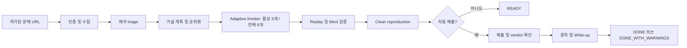

# CTF Agent Codex

[English](README.md) | [한국어](README.ko.md)

[](https://github.com/Clotilde030603/ctf-agent-codex/actions/workflows/ci.yml)


**허가받은 CTF 문제 URL을 입력하면 문제를 수집하고, 여러 풀이 접근을 실행하고,
플래그 후보를 검증하고, 선택적으로 제출한 뒤 재현 가능한 증적과 Write-up을
남기는 자율형 CTF 에이전트입니다.**

> 명시적으로 참가하거나 허가받은 CTF, 퇴역 문제, 워게임, 실습 환경에서만
> 사용하십시오. 이 프로젝트는 범용 공격 도구가 아니며 제3자 시스템을
> 테스트할 권한을 부여하지 않습니다.

## CTF Agent Codex란?

CTF Agent Codex는 결정론적 Python controller와 역할별로 설정 가능한 Codex
모델로 구성된 로컬 자율형 CTF 도우미입니다. Controller가 상태, 접근 범위,
예산, 검증, 제출을 통제합니다. 모델은 가설을 만들고 artifact를 분석하고,
통제된 도구를 사용하고, solver를 작성할 수 있지만 안전 gate를 건너뛰거나
임의의 값을 제출할 수 없습니다.

단순히 flag처럼 보이는 모델 답변을 받는 것이 아니라, 인증·HTTP·browser·
packaged skill 가용성을 하나의 Controller 소유 capability snapshot으로
관리하고, 입력, 분석 artifact, 실행 명령, 후보 provenance, 검증 결과,
플랫폼 verdict, 증적, 재현 방법까지 남기는 프로젝트입니다.

## 주요 기능

| 사용자가 원하는 것 | 에이전트가 제공하는 기능 |
| --- | --- |
| 문제 URL 하나로 시작 | 플랫폼 감지, 세션 확인, 문제 정보, 첨부파일, service host 수집 |
| 낯선 파일 분석 | 재귀 triage, 안전한 archive 해제, category 분류, hash, strings, 도구 결과 |
| 여러 접근 동시 탐색 | 증거 순위 기반 progressive deepening adaptive frontier: 전체 hypothesis 최대 6개, 동시에 활성화되는 격리 비동기 solver lane 최대 3개 |
| 실제 도구의 안전한 사용 | non-root CTF 도구 container, argv 명령, host-scoped HTTP action |
| 잘못된 플래그 방지 | format, provenance, replay, hardcode, 데이터 의존성, blind reviewer 검증 |
| 보수적인 제출 | Wrong budget, 중복 차단, pending 복구, dry-run, 수동 검토 모드 |
| 중단된 실행 재개 | SQLite checkpoint, 비밀 제외 설정 snapshot, 명시적 resume override |
| 결과물 보존 | `solve.py`, event ledger, SHA-256 manifest, Markdown/HTML, provenance JSON |
| Accepted 이후 복구 | 증적 개별 재시도, sanitized fallback, `DONE_WITH_WARNINGS` |

## 동작 방식



실행 시 CLI는 `AutonomousWorkflow`와 Controller 기반 run state(SQLite schema
v7 및 `events.jsonl`)를 생성합니다. 기본 `codex` 경로는 deterministic
artifact/category preflight 후 `ModelHypothesisPlanner`, `WorkerCore`를 통한
제한된 `ModelSolverSpecialist` lane, replay 및 blind 검증, 제출, 증적,
Write-up, reproduction을 수행합니다. Static mode는 명시적인 deterministic
fallback이며 independent verification이 아닙니다.

## 현재 프로젝트 상태

현재 저장소는 **실행 가능한 alpha vertical slice**입니다. 인증, HTTP, browser, packaged skill 가용성은 Controller가 소유한 하나의 capability snapshot으로 표현됩니다. Controller 전체 흐름,
Codex CLI backend, 격리 worker, CTFd/rCTF adapter, 검증 기록, 증적 복구,
Write-up 생성, 로컬 benchmark runner가 구현되어 있고 자동 테스트로 검증됩니다.

중요한 제한사항:

- 깊은 Pwn 및 Reverse Engineering exploit은 아직 experimental입니다.
- Generic HTML 수집은 안전한 제출 endpoint를 추측하지 않습니다.
- Claude backend는 production 연동이 아닌 테스트 stub입니다.
- 다양한 live CTF theme, MFA, 동적 instance에 대한 폭넓은 호환성은 아직
  검증되지 않았습니다.
- 포함된 12개 문제 B0-B5 로컬 pilot은 자체 제작 계측이며 고난도 실전 CTF
  성능을 의미하지 않습니다.

## 요구사항

- macOS 또는 Linux. Windows에서는 native 대신 WSL2를 사용하십시오.
- Python 3.12 또는 3.13
- Docker CLI와 실행 중인 Docker daemon
- 기본 모델 workflow를 위한 설치·로그인된 Codex CLI
- browser 로그인과 PNG 증적을 위한 Playwright Chromium
- 대상 CTF 자동화에 대한 명시적 허가

## 설치

```bash
git clone https://github.com/Clotilde030603/ctf-agent-codex.git
cd ctf-agent-codex

python3.12 -m venv .venv
source .venv/bin/activate
python -m pip install --upgrade pip
python -m pip install -e ".[browser]"
playwright install chromium
```

Versioned CTF 도구 image 빌드:

```bash
docker build -t ctf-agent-codex-tools:0.1.0 \
  -f docker/ctf-tools/Dockerfile .
```

격리된 CLI 환경으로 설치할 수도 있습니다.

```bash
pipx install ".[browser]"
```

## Codex 설정

[Codex CLI 공식 문서](https://learn.chatgpt.com/docs/codex/cli)에 따라 설치한 뒤
한 번 실행하여 로그인합니다.

```bash
codex
codex --version
codex login status
```

저장소는 Codex 자격증명을 저장하지 않습니다. 선택한 CLI executable을 호출하고
설정된 model 이름과 reasoning effort만 전달합니다.

## 최초 CTF 플랫폼 인증

CTF 플랫폼 인증은 Codex 인증과 별개입니다. 지원되는 CTFd 사이트에서는 먼저
API session을 확인합니다. Session이 없고 저장된 browser state도 없으면
Playwright가 보이는 Chromium 창을 엽니다.

1. 열린 browser에서 CTF에 로그인합니다.
2. MFA나 CAPTCHA가 있다면 직접 완료합니다.
3. 에이전트가 Playwright storage state를 `0600` 권한으로 저장합니다.
4. Scoped HTTP session이 browser cookie를 가져와 작업을 계속합니다.

기본 session 경로는 `runs/.sessions/<challenge-host>.json`입니다. Password처럼
취급하고 commit하거나 issue에 첨부하지 마십시오.

## Quick Start

먼저 전체 로컬 실행 환경을 확인합니다.

```bash
ctf-agent doctor
```

선택적으로 결정론적 paired evaluation 실행:

```bash
ctf-agent benchmark evals/manifest.v2.yaml \
  --ablation-matrix evals/ablations.yaml \
  --output report.json
```

Benchmark는 필수 challenge solve path가 아닌 개발/평가용 subsystem입니다.
일반 pull-request CI에서는 benchmark workload를 실행하지 않습니다. Full B0-B5
평가는 전용 `Full B0-B5 Benchmark` workflow에서 manual dispatch, nightly
schedule 또는 published release 때 실행합니다.

레거시 `evals/manifest.yaml` 명령은 retired warmup/harness smoke test일 뿐이며
autonomous-workflow benchmark가 아니고 모델 성능 증적으로 사용하면 안 됩니다.
권위 있는 평가는 manifest v2와 scorer가 소유한 실제 `AutonomousWorkflow`를
사용합니다.

외부 제출 없이 허가된 문제 실행:

```bash
ctf-agent solve "https://ctf.example/challenges/123" \
  --dry-run \
  --writeup
```

대회 규정이 자동 제출을 명시적으로 허용할 때:

```bash
ctf-agent solve "https://ctf.example/challenges/123" \
  --auto-submit \
  --writeup
```

`--auto-submit`을 사용하지 않으면 `READY`에서 멈추고 제출 endpoint를 호출하는
대신 private `verified-candidate.json`을 기록합니다.

### Gajae Code에서 자연어로 실행

저장소 경로에서 `gjc`를 실행한 뒤 다음처럼 요청할 수 있습니다. `<문제 링크>`만
실제 문제 URL로 바꾸면 됩니다.

```text
<문제 링크>

위 사이트는 내가 참가 중인 허가된 CTF 문제 사이트야.

로그인이 필요하면 로그인 창을 열어줘.
로그인 창을 연 뒤에는 로그인 페이지 이탈 여부, 인증 session cookie,
로그아웃 버튼 또는 인증된 사용자 화면을 주기적으로 확인해줘.

내가 별도로 "로그인 완료"라고 입력하기를 기다리지 말고,
로그인 성공이 감지되면 자동으로 다음 작업을 계속해줘.

문제를 분석하고 풀이한 뒤 플래그를 자동 제출해줘.
정답이 확인되면 문제 화면, 풀이 과정, 플래그 출력, 제출 결과를 증적으로 캡처하고,
해당 증적을 기반으로 재현 가능한 Markdown/HTML Write-up까지 자동으로 작성해줘.
```

## 사용법

### 모델과 reasoning effort 선택

```bash
ctf-agent solve "<challenge-url>" \
  --backend codex \
  --planner-model "<planner-model>" \
  --solver-model "<solver-model>" \
  --reviewer-model "<reviewer-model>" \
  --planner-effort medium \
  --solver-effort xhigh \
  --reviewer-effort high \
  --max-workers 3 \
  --dry-run
```

`--reasoning-effort`는 세 역할에 대한 shorthand입니다. 역할별 option을 함께
지정하면 역할별 값이 우선합니다. Model identifier는 사용자가 설정합니다.

### 중단된 실행 재개

```bash
ctf-agent resume <run-id>
ctf-agent resume <run-id> --solver-model "<model>" --solver-effort xhigh
```

Resume은 최초 실행의 비밀 제외 설정 snapshot을 복원합니다. 명시적으로 지정한
option만 override합니다. 최초 URL에 secret query가 있었다면 `--challenge-url`로
메모리에 다시 전달하며 디스크에는 redacted 상태로 유지됩니다.
`SOLVE` 또는 `VERIFY` 상태에서 재개 중 인증이 필요하면 Controller는
`AUTHENTICATE`로 전환하고 설정된 인증 경로를 연 뒤, 재인증이 성공한 경우에만
중단된 상태로 돌아갑니다. 메모리의 인증 handle 자체는 process restart 후
복원되지 않습니다.

### Accepted 이후 증적 재시도

```bash
ctf-agent retry-evidence <run-id>
```

Durable Accepted/Already Solved run에서만 동작하며 풀이를 다시 열거나 flag를
재제출하지 않습니다.

### 자주 사용하는 다른 option

```bash
# 허가된 private-address lab
ctf-agent solve "http://127.0.0.1:8000/challenges/7" \
  --allow-private-host --dry-run

# 원본 flag를 숨긴 공개 보고서
ctf-agent solve "<challenge-url>" --auto-submit --redact-flag

# Write-up 생략
ctf-agent solve "<challenge-url>" --auto-submit --no-writeup

# 다른 run 디렉터리 또는 container image
ctf-agent solve "<challenge-url>" \
  --runs-dir /path/to/runs \
  --docker-image ctf-agent-codex-tools:0.1.0
```

`--allow-local-reproduction`은 명시적인 약한 host fallback입니다. Static mode
자동 제출은 operator가 `--approve-static-submit`을 명시하지 않으면 차단됩니다.
가능하면 모델 기반 independent review를 사용하십시오.

## 자동 플래그 검증과 제출

Flag처럼 보이는 문자열만으로는 자동 제출하지 않습니다. Format과 출처를 확인하고,
solver를 replay하고, hardcode를 거부하고, 결과가 원본 artifact에 의존하는지 검사하며,
Codex mode에서는 별도 blind reviewer를 사용합니다. Clean Docker reproduction은
제출 전에 수행됩니다.

제출 단계는 과거 Wrong 후보를 차단하고 durable attempt를 먼저 예약하며, timeout이나
rate limit 뒤에 동일 값을 무조건 재제출하지 않습니다.

## 지원 플랫폼

| 플랫폼 | 수집 | 인증 | 제출 |
| --- | --- | --- | --- |
| CTFd | API 우선, HTML fallback | 기존 session 또는 Playwright 로그인 | 지원, theme별 호환성은 experimental |
| rCTF | v1/v2 문제·attachment mapping | session test endpoint | 지원, fake integration 검증 |
| Generic HTML | 제목, 설명, link, attachment | 공개/basic HTTP, custom session은 코드에서 주입 | endpoint를 추측하지 않고 자동 제출 중단 |

## 지원 CTF Category

| Category | 현재 지원 범위 |
| --- | --- |
| Crypto | Base64/hex, single/repeating XOR, Caesar substitution, 선택적 PyCryptodome/z3 routing |
| Forensics/Misc | 재귀 extraction, metadata, PNG text, PCAP/tshark 관찰, tool-output provenance |
| Web | source route, parameter, GraphQL operation, WebSocket URL, scoped HTTP worker action |
| Reverse Engineering | binutils/rizin/Ghidra/angr profile과 model-worker harness, 깊은 reversing은 experimental |
| Pwn | checksec/GDB/pwntools/ROPgadget profile과 model-worker harness, exploit은 experimental |

선택 dependency가 없으면 설치 방법과 fallback 상태를 명확히 기록하며 성공으로
조용히 처리하지 않습니다.

## 출력 디렉터리

`runs/` 아래의 실행 디렉터리에는 생성된 `solve.py`, 원본과 생성 artifact,
`events.jsonl`, 증적 screenshot과 manifest, `writeup.md`, `writeup.html`,
`provenance.json`이 저장됩니다. Dry run은 수동 검토용
`verified-candidate.json`도 생성합니다.

Screenshot이 실패하면 성공한 capture는 보존하고 sanitized fallback 증적을 기록합니다.
Run은 `DONE_WITH_WARNINGS`로 끝날 수 있으며 이후 누락된 증적만 다시 시도할 수 있습니다.

## 설정

```bash
cp .env.example .env
```

| 변수 | 기본값 | 목적 |
| --- | --- | --- |
| `CTF_BACKEND` | `codex` | model workflow 또는 명시적 static mode 선택 |
| `CTF_PLANNER_MODEL` | `gpt-5.6-sol` | planner model identifier |
| `CTF_SOLVER_MODEL` | `gpt-5.6-sol` | solver model identifier |
| `CTF_VERIFIER_MODEL` | `gpt-5.6-sol` | blind reviewer model identifier |
| `CTF_MODEL_CALL_BUDGET` | `20` | 공유 run 전체 model-call 예산. 기본값에서는 elastic 확장이 비활성화되어 있으며(`CTF_MODEL_BUDGET_MAX_EXTENSIONS=0`), 활성화하면 persisted `ProgressEvidence`가 필요하고 planner/verifier reserve를 보존하며 hard limit 안에서만 확장 |
| `CTF_MODEL_BUDGET_VERIFIER_FLOOR` | `1` | 빌릴 수 없는 verifier reserve |
| `CTF_MODEL_BUDGET_MAX_EXTENSIONS` | `0` | 증거로 허가되는 elastic 확장 최대 횟수 |
| `CTF_MAX_HYPOTHESES` | `6` | 전체 frontier pool에 허용되는 hypothesis 최대 수 |
| `CTF_MAX_WORKERS` | `3` | 동시 solver lane 최대 수 |
| `CTF_LANE_QUANTUM_STEPS` | `2` | lane scheduling quantum당 제한된 model step 수 |
| `CTF_FRONTIER_ACTIVE_WIDTH` | `3` | 동시에 활성화되는 lane 최대 수 |
| `CTF_FRONTIER_TOTAL_POOL` | `6` | frontier가 유지하는 전체 hypothesis 최대 수 |
| `CTF_FRONTIER_MAX_ROUNDS` | `3` | progressive deepening 최대 round 수 |
| `CTF_CONTEXT_RECENT_REPORT_LIMIT` | `3` | 최근 report window; durable verified fact는 별도 보존 |
| `CTF_SUBMISSION_BUDGET` | `1` | durable 제출 시도 한도 |
| `CTF_ALLOW_PRIVATE_HOSTS` | `false` | 허가된 private target 허용 |
| `CTF_ALLOW_LOCAL_REPRODUCTION` | `false` | 약한 host replay opt-in |
| `CTF_APPROVE_STATIC_SUBMISSION` | `false` | static 제출 명시적 승인 |
| `CTF_REDACT_FLAG` | `false` | 공개 output에서 raw flag 숨김 |
| `CTF_DOCKER_IMAGE` | `ctf-agent-codex-tools:0.1.0` | worker/reproduction image |

Role별 projection 기본값은 planner/replan/verifier/reviewer `131072` bytes, solver `196608` bytes이며 `CTF_MAX_MODEL_CONTEXT_BYTES=196608`은 backend ceiling입니다. 모든 timeout, retry, extraction, worker, model, rate, redaction 설정은 [.env.example](.env.example)을 참고하십시오.

Benchmark authority는 scorer가 소유한 실제 `AutonomousWorkflow`입니다. command 출력과 self-reported metric은 진단용일 뿐이며, 로컬 B0-B5 fixture는 offline synthetic/instrumentation 사례로 실제 모델 성능 주장이 아닙니다.

패키지된 category skill은 trusted registry에서 로드되고 hash와 함께 기록됩니다. Durable lane checkpoint, CAS fact, lifecycle/frontier event, crash recovery는 versioned state artifact를 사용하며, controller command receipt와 durable redaction/private mode를 기록합니다. 인증 handle은 process restart 후 유지되지 않아 실제 reauthentication route가 필요합니다. Report는 scorer 소유의 필수 metric과 결정론적 통계 및 재현 가능한 context byte를 사용합니다.

## 문제 해결

### 먼저 doctor 실행

```bash
ctf-agent doctor
```

Python, 선택 backend/model, Codex CLI/authentication, Docker CLI/daemon, tool image,
Playwright Chromium, runs directory 쓰기 권한을 검사합니다. Docker executable만 있고
daemon이 꺼진 상태는 오류로 판정합니다.

### Codex가 없거나 로그아웃됨

```bash
command -v codex
codex login status
```

Codex를 설치·로그인하거나 non-model dry run을 위해 의도적으로
`--backend static`을 선택합니다. Static replay는 independent verification이 아닙니다.

### Docker 또는 tool image 없음

Daemon을 시작하고 `docker/ctf-tools/Dockerfile`을 빌드한 뒤 doctor를 다시 실행합니다.
Docker가 없으면 기본 reproduction gate는 fail-closed합니다.

### Browser 로그인 또는 screenshot 실패

```bash
python -m pip install -e ".[browser]"
playwright install chromium
```

Session이 만료됐다면 해당 host의 session 파일만 삭제합니다. Accepted 이후에는
`retry-evidence`로 재제출 없이 누락 screenshot을 다시 캡처합니다.

### 후보가 발견됐지만 제출되지 않음

`events.jsonl`, `artifacts/specialist-results.json`, `verified-candidate.json`을
확인합니다. 일반적인 원인은 provenance 부족, hardcoded output, negative control 실패,
reviewer 불일치, integrity hash 변경, 과거 Wrong, budget 소진입니다.

### Resume이 run을 찾지 못함

최초 실행과 같은 `--runs-dir`을 지정합니다. 저장된 URL에 `REDACTED`가 있다면
원본 `--challenge-url`도 전달합니다.

## 추가 문서

- [상태 머신과 복구](docs/state-machine.md)
- [Security model](docs/security-model.md)
- [Model routing](docs/model-routing.md)
- [Verification](docs/verification.md)
- [Docker tool image](docs/docker-tools.md)
- [Benchmark](docs/evaluation.md)

## 라이선스

이 프로젝트는 [MIT License](LICENSE)를 따릅니다.

## 면책 고지

이 소프트웨어는 experimental 상태이며 보증 없이 제공됩니다. 사용자는 target 허가,
대회 규칙, AI/자동화 정책, submission penalty, 도구를 사용해 수행한 모든 행동에
책임이 있습니다.
