# CTF Agent Codex

[English](README.md) | [한국어](README.ko.md)

[](https://github.com/Clotilde030603/ctf-agent-codex/actions/workflows/ci.yml)


**A Codex-powered autonomous CTF agent that collects a challenge, analyzes and solves it, verifies and submits the flag, captures evidence, and generates a reproducible write-up.**

> Project status: **experimental, executable vertical slice**. The deterministic workflow, CTFd API path, verification gate, evidence pipeline, resume support, and local fixtures are implemented and tested. Deep model-driven category solvers are not yet complete.

What you get:

- challenge collection from one URL, with session reuse and attachment download;
- recursive triage, classification, and up to three hypothesis lanes;
- provenance-aware flag verification before any submission;
- Accepted/Wrong parsing with a durable submission budget;
- `solve.py`, evidence images, an event ledger, and `writeup.md`;
- SQLite checkpoints and `ctf-agent resume` after interruption.

```bash
git clone https://github.com/Clotilde030603/ctf-agent-codex.git
cd ctf-agent-codex
python3.12 -m venv .venv
source .venv/bin/activate
python -m pip install -e ".[browser]"
playwright install chromium
docker version  # the daemon must be running for default reproduction
```

```bash
ctf-agent solve "https://ctf.example.com/challenges/123" --auto-submit --writeup
```

## What is CTF Agent Codex?

CTF Agent Codex is a local Python application for authorized CTF competitions, retired challenges, war games, and training labs. You provide one challenge URL. A deterministic controller authenticates, downloads the challenge, analyzes preserved artifacts, plans independent hypotheses, runs solver lanes, verifies candidates, optionally submits an approved flag, captures evidence, and tests the final solver again.

The language model does **not** control workflow state. Python owns this fixed progression:

```text
AUTHENTICATE -> INGEST -> TRIAGE -> PLAN -> SOLVE -> VERIFY
-> SUBMIT -> EVIDENCE -> WRITEUP -> REPRODUCE -> DONE
```

This separation makes submission decisions, retries, resume behavior, and evidence generation auditable.

## Why This Project?

Many proof-of-concept CTF agents stop when a model prints a flag-looking string. This project treats that string as an untrusted candidate. It records where the value came from, rejects examples and placeholders, reruns the solver, checks past Wrong verdicts and the remaining budget, and only then allows submission.

The project also preserves the work product. A successful run is meant to leave a reproducible solver, evidence, structured analysis, state checkpoints, and a fact-bound write-up instead of only a chat transcript.

## Key Features

| Capability | Status | What it does today |
| --- | --- | --- |
| URL-based challenge ingestion | Experimental | CTFd API ingestion and generic HTML fallback |
| Session reuse and browser login | Experimental | Reuses Playwright storage state; opens Chromium for first CTFd login |
| Attachment download | Implemented | Scoped HTTP download with filename and traversal protection |
| Recursive triage | Implemented | Hashes, MIME/magic hints, entropy, strings, indicators, safe zip/tar extraction, optional tools |
| Category classification | Experimental | Classifies web, pwn, rev, crypto, forensics, misc, and mixed signals |
| Hypothesis scheduler | Implemented | Up to three concurrent, structured lanes |
| Built-in solver | Experimental | Reproduces direct flag-bearing artifact signals into `solve.py` |
| Category-specific exploit solvers | Planned | Full web/pwn/rev/crypto/forensics model-driven solvers are not wired into the default workflow |
| Codex backend | Experimental | Async CLI adapter and schema validation are tested; default workflow currently uses the deterministic specialist |
| Claude backend | Stub | Testable adapter stub only; no production Claude connection |
| Flag verification gate | Implemented | Format, placeholder, provenance, replay, Wrong-history, and budget checks |
| Automatic submission | Experimental | CTFd submission, verdict parsing, crash-safe pending attempts, duplicate prevention |
| Evidence and write-up | Experimental | Three evidence images, sanitized transcript, manifest, generated and validated Markdown |
| Resume | Implemented | Durable SQLite state plus append-only JSONL events |
| Benchmark runner | Implemented | Offline YAML manifests with solve timing and reproduction metrics |

## How It Works

```mermaid
flowchart LR
    A[Challenge URL] --> B[Authentication]
    B --> C[Challenge Collection]
    C --> D[Recursive Triage]
    D --> E[Hypothesis Planning]
    E --> F[Specialist Solvers]
    F --> G[Flag Verification]
    G --> H[Automatic Submission]
    H --> I[Accepted Evidence]
    I --> J[Clean Reproduction]
    J --> K[Reproducible Write-up]
```



The controller records every state transition. Recoverable solve and verification failures return to planning or solving. Wrong submissions are remembered and cannot be submitted again. An uncertain submission left by a crash is resolved from platform state or fails closed; it is never blindly repeated.

## Supported Challenge Categories

The table distinguishes deterministic analysis from autonomous deep solving.

| Category | Analysis status | Autonomous solving status | Main tooling |
| --- | --- | --- | --- |
| Web | Experimental | Planned beyond direct artifact signals | `httpx`, Playwright, route/URL/session indicators |
| Pwn | Experimental | Planned | `file`, `strings`, optional `checksec`; pwntools integration is not included yet |
| Reverse engineering | Experimental | Planned | Imports/strings/language signals; Ghidra/ReVa integration is planned |
| Crypto math | Experimental | Planned | Deterministic constant and vocabulary detection |
| Crypto binary | Experimental | Planned | Encoding/crypto implementation indicators |
| Forensics | Experimental | Experimental for direct artifact signals | Metadata-oriented triage, archive provenance, optional `exiftool`/`binwalk` |
| Misc / mixed | Experimental | Planned dynamic routing | Weighted multi-category classification |

Do not interpret category detection as a claim that every challenge in that category can already be solved autonomously.

## Supported Platforms

| Platform | Status | Authentication | Collection | Auto submit |
| --- | --- | --- | --- | --- |
| CTFd | Experimental, integration-tested | API session check; optional Playwright login and storage reuse | API first, HTML fallback | Yes |
| Generic HTML | Experimental | Public/basic HTTP fetch; a custom session must be injected in code | Title, description, links, and flag hints | No generic submission endpoint |
| rCTF | Planned | Not implemented | Generic fallback only | No |

The automated test suite uses fake and `httpx.MockTransport` CTFd fixtures. It does not contain a real account, cookie, or active competition flag.

## Current Project Status

- Release: `0.1.0`
- Overall maturity: **Experimental**
- Automated tests: 50 unit/integration tests in the current branch
- Verified workflow: fake/Mock CTFd ingestion → triage → candidate → verification → Accepted → evidence → write-up → reproduction
- Not yet verified against: every CTFd theme/version, live MFA providers, native Windows, or a real deep exploit challenge

For milestone details, see [docs/implementation-log.md](docs/implementation-log.md).

## Requirements

Required:

- macOS or Linux; WSL2 is expected to work but is not continuously tested;
- Python 3.12 or newer supported by the pinned dependencies;
- Git;
- Docker with a running daemon for the default clean-reproduction gate;
- explicit authorization to access and automate the target CTF.

Required for browser authentication and PNG evidence:

- Playwright's Chromium browser.

Required for model-backed lanes:

- the Codex CLI installed and signed in.

Optional analysis tools are detected at runtime: `file`, `strings`, `checksec`, `exiftool`, and `binwalk`. Missing optional tools are reported in triage instead of being installed automatically.

Native Windows has not been tested. Use WSL2 rather than assuming native Windows support.

## Installation

### macOS, Linux, and WSL2

```bash
git clone https://github.com/Clotilde030603/ctf-agent-codex.git
cd ctf-agent-codex

python3.12 -m venv .venv
source .venv/bin/activate

python -m pip install --upgrade pip
python -m pip install -e ".[browser]"
playwright install chromium
```

Install Docker using the instructions for your operating system, start the daemon, then verify everything visible to the application:

```bash
python --version
docker version
ctf-agent --help
```

For development dependencies, install `.[dev,browser]` instead.

## Codex Setup

The project includes a tested asynchronous Codex CLI backend, but model-driven specialist execution remains experimental and is not the default solver path yet.

According to the [official Codex CLI documentation](https://developers.openai.com/codex/cli), macOS and Linux users can install or update Codex with:

```bash
curl -fsSL https://chatgpt.com/codex/install.sh | sh
```

Then open a terminal and run:

```bash
codex
```

On first launch, select **Sign in with ChatGPT** or another sign-in method offered by Codex. Verify the executable and authentication before enabling model-backed lanes:

```bash
codex --version
codex
```

This repository does not store your Codex credentials. Codex authentication is managed by the Codex CLI itself. `CTF_CODEX_BINARY` is a centralized setting reserved for model-workflow wiring; the default deterministic workflow does not currently consume it.

## First-Time Authentication

CTF platform authentication is separate from Codex authentication.

For CTFd, the agent first requests `/api/v1/users/me` using any reusable session. If authentication is missing:

1. Playwright launches Chromium. A visible browser is used when no storage state exists.
2. Log in on the CTF platform page that opens.
3. Complete MFA or CAPTCHA in that browser if the platform requires it.
4. The agent polls for a logout/authenticated selector or a session cookie after leaving `/login`.
5. When authentication is detected, browser storage state is saved with file mode `0600`.
6. The API session imports the browser cookies and automation continues without a terminal Enter prompt.

Default session location:

```text
runs/.sessions/<challenge-host>.json
```

Override it with `CTF_BROWSER_STORAGE_STATE`. The default `runs/` path and common session/profile names are Git-ignored. Storage state can contain live cookies and must still be treated as a password: do not upload it, attach it to an issue, or commit it.

If the stored session expires while the file still exists, delete that host's storage-state file and rerun the command to force a visible login browser.

## Quick Start

Use an authorized CTFd challenge URL:

```bash
ctf-agent solve "https://ctf.example.com/challenges/123" \
  --auto-submit \
  --writeup
```

The current end-to-end completion path expects `--auto-submit`. If you omit it, the agent performs collection, triage, solving, and verification but fails closed at the external submission boundary instead of submitting the candidate.

## Usage

Show the authoritative local command reference:

```bash
ctf-agent --help
ctf-agent solve --help
ctf-agent resume --help
ctf-agent benchmark --help
```

Solve, submit, and write the report:

```bash
ctf-agent solve "<challenge-url>" --auto-submit --writeup
```

Disable the Markdown write-up while keeping the Accepted/evidence/reproduction path:

```bash
ctf-agent solve "<challenge-url>" --auto-submit --no-writeup
```

Store runs elsewhere:

```bash
ctf-agent solve "<challenge-url>" --auto-submit --runs-dir /path/to/ctf-runs
```

Allow an explicitly authorized localhost/private-address lab:

```bash
ctf-agent solve "http://127.0.0.1:8000/challenges/7" \
  --auto-submit \
  --allow-private-host
```

Use the weaker local reproduction mode only when Docker cannot be used:

```bash
ctf-agent solve "<challenge-url>" \
  --auto-submit \
  --allow-local-reproduction
```

This opt-in runs `python3 -I solve.py` on the host. It is not equivalent to clean Docker reproduction.

There is currently no `status`, `--session`, or `--no-submit` option. Do not rely on examples from design documents or older plans; use `--help`.

## Automatic Flag Verification and Submission

`--auto-submit` does not submit the first flag-looking string. Each candidate must pass:

1. the challenge's flag-format policy;
2. sample and placeholder rejection;
3. artifact, location, derivation, and solver-command provenance checks;
4. fresh-process `solve.py` replay;
5. an independent deterministic verifier path;
6. past Wrong-candidate rejection;
7. the configured submission budget;
8. a durable pending-attempt reservation before the external request.

Accepted, Already Solved, Wrong, rate-limited, and unknown responses are parsed separately. A crash in the submission window cannot silently spend a second attempt: resume resolves the pending attempt from platform state or fails closed.

Automatic submission can incur penalties. Confirm that the event rules allow AI assistance and automation before using `--auto-submit`.

## Evidence Capture

After Accepted, the workflow requires:

- `01-challenge.png`: challenge content;
- `02-exploit-proof.png`: final solver output;
- `03-accepted.png`: Accepted/Solved platform state;
- `02-exploit-proof.html`: sanitized terminal transcript;
- `manifest.json`: SHA-256 hashes, labels, timestamps, source, and redaction metadata.

The browser captures the challenge content region, not the desktop. Terminal rendering redacts common cookies, bearer tokens, API keys, CSRF tokens, passwords, and session values. Missing platform screenshots fail the evidence stage rather than producing a false success.

## Automatic Write-up Generation

`writeup.md` is generated from persisted facts rather than model conversation memory. Inputs include `challenge.json`, `triage.json`, hypotheses, verified events, `solve.py`, submission outcome, and the evidence manifest.

A deterministic reviewer checks required headings, evidence hashes and existence, unsupported flag-looking values, and secret-like material. Use `--no-writeup` to skip Markdown generation.

## Resuming an Interrupted Run

```bash
ctf-agent resume <run-id>
```

The controller loads `state.db` and continues from the last state. Completed work is checkpointed, while append-only events remain in `events.jsonl`.

Challenge URLs with credential-bearing query parameters are stored redacted. Re-supply the original URL in memory when resuming such a run:

```bash
ctf-agent resume <run-id> \
  --challenge-url "https://ctf.example/challenge?token=..."
```

Use the same `--runs-dir` on resume if the original run used a custom directory:

```bash
ctf-agent resume <run-id> --runs-dir /path/to/ctf-runs
```

## Output Directory

The current path uses the challenge host, challenge path, and generated run ID:

```text
runs/<challenge-host>/<challenge-path>-<run-id>/
├── challenge.json
├── state.db
├── triage.json
├── hypotheses.json
├── events.jsonl
├── files/
├── artifacts/
│   └── specialist-results.json
├── solve.py
├── requirements.txt
├── evidence/
│   ├── 01-challenge.png
│   ├── 02-exploit-proof.html
│   ├── 02-exploit-proof.png
│   ├── 03-accepted.png
│   └── manifest.json
└── writeup.md
```

Most useful files:

| File | Purpose |
| --- | --- |
| `solve.py` | Final reproducible solver for the preserved challenge files |
| `writeup.md` | Fact-bound generated solution document |
| `evidence/` | Challenge, exploit, Accepted proof, and integrity manifest |
| `state.db` | State, checkpoints, rejected candidates, and submission attempts for resume |
| `events.jsonl` | Append-only state, verification, submission, and reproduction history |
| `triage.json` | Recursive file inventory, indicators, tool results, and classification |
| `artifacts/` | Raw tool output, extracted files, and specialist results |

Do not publish a real run directory without reviewing it for challenge flags, event-private data, and platform policy restrictions.

## Configuration

Copy the tracked example and edit only what you need:

```bash
cp .env.example .env
```

`pydantic-settings` reads `.env` with the `CTF_` prefix. Important settings:

| Variable | Default | Effect / trade-off |
| --- | --- | --- |
| `CTF_RUNS_DIR` | `runs` | Run and session root; keep it outside tracked source if desired |
| `CTF_REQUEST_TIMEOUT_SECONDS` | `20` | HTTP request timeout setting; full adapter wiring is planned |
| `CTF_TOOL_TIMEOUT_SECONDS` | `30` | Triage tools and solver replay timeout; browser/terminal capture currently has its own 30-second default |
| `CTF_RETRY_BUDGET` | `2` | Reserved setting; retry enforcement is planned |
| `CTF_SUBMISSION_BUDGET` | `3` | Maximum durable submission attempts per run |
| `CTF_MAX_HYPOTHESES` | `3` | Configured cap; default workflow currently creates three hypotheses |
| `CTF_MAX_STATE_STEPS` | `100` | Stops deterministic replanning loops |
| `CTF_MAX_EXTRACTION_DEPTH` | `3` | Archive recursion limit |
| `CTF_MAX_EXTRACTED_BYTES` | `268435456` | Total extraction ceiling, 256 MiB |
| `CTF_RATE_LIMIT_PER_SECOND` | `2` | Reserved setting; request pacing enforcement is planned |
| `CTF_BROWSER_STORAGE_STATE` | unset | Explicit Playwright storage-state location |
| `CTF_ALLOW_PRIVATE_HOSTS` | `false` | Allows private/loopback targets; use only for authorized labs |
| `CTF_ALLOW_LOCAL_REPRODUCTION` | `false` | Replaces Docker gate with weaker host `python -I` replay |
| `CTF_DOCKER_IMAGE` | `python:3.12-slim` | Image used for clean solver replay |

The `.env` file is Git-ignored. Never put a real flag, cookie, password, or API key in `.env.example`.

## Model Configuration

| Variable | Default |
| --- | --- |
| `CTF_PLANNER_MODEL` | `gpt-5.6-sol` |
| `CTF_SOLVER_MODEL` | `gpt-5.6-sol` |
| `CTF_VERIFIER_MODEL` | `gpt-5.6-sol` |
| `CTF_PLANNER_EFFORT` | `high` |
| `CTF_SOLVER_EFFORT` | `xhigh` |
| `CTF_VERIFIER_EFFORT` | `high` |
| `CTF_CODEX_BINARY` | `codex` |

These settings are implemented and centralized, but they are not yet wired into the default deterministic workflow. Model-driven category solvers and cost reporting remain roadmap work. Model availability and reasoning-effort support depend on the user's Codex account and current Codex CLI.

The Claude adapter is a test stub. There is no production Claude authentication or API call in this release.

## Security and Scope Restrictions

Use this tool only against targets you are explicitly authorized to test: CTF competitions, retired challenges, war games, and training labs.

- The original challenge host is the initial network scope.
- Attachment and remote-service hosts must be declared by challenge data before use.
- Redirect targets are checked again; wildcard internet scanning is forbidden.
- Private and loopback hosts are blocked unless `--allow-private-host` is explicit.
- Supported zip/tar extraction enforces traversal, depth, file-count, and total extracted-size limits. `max_file_size` limits scan reads, not individual archive-member extraction.
- Docker replay uses CPU, memory, PID, read-only filesystem, timeout, and no-network restrictions.
- Signed URL tokens and similar query secrets are redacted before SQLite/JSONL persistence.
- Browser storage, cookies, `.env`, `runs/`, and database files are not intended for Git.
- External skills and executable dependencies must be reviewed; the agent does not auto-install them at runtime.

Before enabling automatic submission, check whether the competition permits AI tools, automated solvers, and automated flag submission. Authorization is the user's responsibility.

See [docs/security.md](docs/security.md) and [docs/verification.md](docs/verification.md).

## Troubleshooting

### `codex` is not found

- Symptom: model-backed execution reports a missing executable.
- Check: `command -v codex && codex --version`
- Fix: install Codex from the [official CLI guide](https://developers.openai.com/codex/cli), restart the shell, and verify `CTF_CODEX_BINARY` if customized.

### Codex sign-in fails

- Symptom: Codex opens but cannot authenticate.
- Check: run `codex` interactively and inspect its displayed sign-in error.
- Fix: complete an offered sign-in method in Codex. This project does not manage Codex credentials.

### Playwright or Chromium is missing

- Symptom: `BrowserUnavailable` or evidence screenshot failure.
- Check: `python -c "import playwright"`
- Fix: `python -m pip install -e ".[browser]"` followed by `playwright install chromium`.

### The login browser does not appear

- Cause: an expired storage-state file exists, so Playwright tries headless reuse.
- Check: inspect `runs/.sessions/` or `CTF_BROWSER_STORAGE_STATE`.
- Fix: delete only the affected host's storage-state file and rerun.

### The session expired

- Symptom: `/api/v1/users/me` remains unauthenticated or login times out.
- Fix: remove the affected storage-state file, rerun, and log in again. Never share the file.

### Challenge parsing fails

- Symptom: missing title, attachments, or a 404/validation failure.
- Check: confirm the URL and whether the site exposes CTFd `/api/v1/challenges/<id>`.
- Fix: verify platform support. Generic HTML parsing is limited and JavaScript-only pages may require adapter work.

### The platform is not CTFd

- Symptom: ingestion falls back to incomplete generic HTML or submission is unavailable.
- Fix: implement a platform adapter. rCTF API support is planned, not currently complete.

### Docker reproduction fails

- Check: `docker version` and `docker run --rm python:3.12-slim python --version`
- Fix: start the daemon and ensure the image can be pulled. `--allow-local-reproduction` is an explicit weaker fallback, not the default fix.

### An optional CTF tool is missing

- Symptom: `missing_capabilities` contains `checksec`, `exiftool`, or `binwalk`.
- Fix: install the tool from a trusted source or continue with reduced triage. The agent will not install it automatically.

### Solver timeout

- Check: inspect `events.jsonl` and the tool stderr artifacts.
- Fix: increase `CTF_TOOL_TIMEOUT_SECONDS` only after confirming the solver is making progress and remains safe.

### A flag was found but verification failed

- Check: inspect the `flag.verification_failed` event, candidate provenance, flag policy, and fresh replay output.
- Fix: correct `solve.py` or produce a new evidence-backed candidate. Do not bypass the gate.

### Platform submission failed or was rate-limited

- Check: inspect the latest `flag.submitted` event and CTF platform response.
- Fix: wait for the **CTF platform's** rate limit, confirm the remaining submission budget, and resume. This is unrelated to GitHub API limits.

### Resume cannot find the run

- Check: use the exact run ID printed by `solve` and the same `--runs-dir`.
- Fix: restore the run directory. If the URL originally had a token, also pass `--challenge-url`.

### Evidence images are missing

- Check: verify Playwright/Chromium, authenticated storage state, and the platform page selectors.
- Fix: refresh authentication and rerun/resume. The workflow intentionally fails closed when all three proof images cannot be created.

## Development

```bash
git clone https://github.com/Clotilde030603/ctf-agent-codex.git
cd ctf-agent-codex
python3.12 -m venv .venv
source .venv/bin/activate
python -m pip install -e ".[dev,browser]"
playwright install chromium
```

Add a platform by implementing the protocol in `src/ctf_agent/platforms/base.py`, enforcing `HostScope`, and adding parsing, verdict, redirect, and integration tests.

Add a specialist by implementing `Specialist` from `src/ctf_agent/specialists/base.py`. Return only structured `SpecialistResult` values, preserve artifact provenance, and never submit inside a specialist.

## Testing

```bash
# Full suite
pytest

# Platform and end-to-end integration fixtures
pytest tests/test_platform.py tests/test_integration_ctfd.py tests/test_e2e.py

# Lint and strict type checking
ruff check src tests evals
mypy src/ctf_agent

# Bytecode/import smoke check
python -m compileall -q src tests evals
```

Tests use fake/retired data only. Do not add live cookies, active private flags, or account credentials to fixtures.

## Benchmarking

Run the included retired fixture:

```bash
ctf-agent benchmark evals/manifest.yaml
```

Manifest shape:

```yaml
challenges:
  - id: local-retired-warmup
    command: [python3, fixtures/retired-warmup/solve.py]
    expected_flag: flag{retired_fixture_only}
```

The current runner reports solved count, elapsed seconds, Solved@15m/30m/60m, Wrong count (currently fixed at zero for command fixtures), exit code, and a `clean_reproduction_rate` compatibility field that currently equals command success. It does **not** perform a separate clean-environment replay. Model/token cost, independent reproduction, and repeat-run reporting are planned.

## Roadmap

- [x] Deterministic state machine and SQLite/JSONL resume
- [x] Scoped CTFd API ingestion and safe attachment download
- [x] Recursive triage and category classification
- [x] Hypothesis scheduler and structured specialist results
- [x] Provenance-aware verification and submission budget
- [x] Crash-safe CTFd submission and verdict parsing
- [x] Evidence manifest, sanitized transcript, and generated write-up
- [x] Fake/Mock CTFd end-to-end and benchmark fixtures
- [ ] Wire model-backed Codex specialists into the default workflow
- [ ] Production category specialists for web, pwn, reverse, crypto, and forensics
- [ ] Complete rCTF API/authentication/submission adapter
- [ ] Live-platform compatibility matrix and selector profiles
- [ ] Remote-service replay verification
- [ ] Production Claude backend
- [ ] Enforce configured HTTP retry and pacing policies
- [ ] Expanded benchmark cost, tool-call, and repeatability metrics
- [ ] Native Windows validation

## Contributing

Contributions are welcome while the project is experimental.

1. Open an issue describing the platform, category, bug, or capability.
2. Include sanitized logs, the relevant state, reproduction steps, and expected behavior.
3. Do **not** attach cookies, storage state, API keys, real credentials, active flags, or an unreviewed run directory.
4. Keep changes small and add focused tests.
5. Run pytest, Ruff, mypy, and the benchmark before opening a pull request.
6. Preserve scope restrictions, deterministic transitions, and the verification gate.

Pull requests that weaken submission safety, silently expand network scope, or add unreviewed runtime installers will not be accepted.

## License

This project is licensed under the [MIT License](LICENSE).

## Disclaimer

This software is provided for educational use and explicitly authorized security competitions and labs. It does not grant permission to test third-party systems. The user is responsible for target authorization, event rules, AI/automation policies, submission penalties, and all actions performed with the tool. The software is experimental and provided without warranty.
