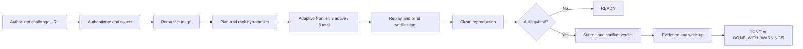

# CTF Agent Codex

[English](README.md) | [한국어](README.ko.md)

[](https://github.com/Clotilde030603/ctf-agent-codex/actions/workflows/ci.yml)


**Give it an authorized CTF challenge URL. It collects the challenge, plans and
runs solving approaches, verifies a candidate flag, optionally submits it, and
leaves reproducible evidence and a write-up.**

> Use this project only in CTF competitions, retired challenges, war games, and
> labs where you have explicit authorization. It is not a general-purpose attack
> tool and does not grant permission to test third-party systems.

## What is CTF Agent Codex?

CTF Agent Codex is a local autonomous CTF assistant built around a deterministic
Python controller and configurable Codex model roles. The controller owns state,
scope, budgets, verification, and submission. Models can propose hypotheses,
inspect artifacts, use controlled tools, and write a solver, but they cannot skip
safety gates or submit arbitrary values.

The project is designed for a user who wants more than a flag-looking model answer. Authentication, HTTP, browser, and packaged-skill availability are represented by one controller-owned capability snapshot.
A run preserves its inputs, reasoning artifacts, commands, candidate provenance,
verification result, platform verdict, evidence, and reproduction instructions.

## Key Features

| What you need | What the agent provides |
| --- | --- |
| Start from one challenge URL | Platform detection, session check, challenge metadata, attachments, and service hosts |
| Analyze unfamiliar files | Recursive triage, safe archive extraction, classification, hashes, strings, and tool output |
| Explore more than one approach | Evidence-ranked adaptive frontier with progressive deepening: up to six hypotheses total and at most three isolated asynchronous solver lanes active |
| Use real tools safely | Non-root CTF tool container, bounded argv commands, and host-scoped structured HTTP actions |
| Avoid false flags | Format, provenance, replay, hardcode, data-dependency, and blind reviewer checks |
| Submit conservatively | Wrong budget, duplicate prevention, pending-attempt recovery, dry-run, and manual review mode |
| Resume interrupted work | SQLite checkpoints, saved non-secret runtime settings, and explicit resume overrides |
| Keep useful results | `solve.py`, event ledger, SHA-256 evidence manifest, Markdown/HTML write-up, provenance JSON |
| Recover after Accepted | Independent evidence retries, sanitized fallbacks, and `DONE_WITH_WARNINGS` |

## How It Works



At runtime, the CLI creates an `AutonomousWorkflow` and controller-backed run
state using SQLite schema v7 and `events.jsonl`. The default `codex` path runs
deterministic artifact/category preflight, `ModelHypothesisPlanner`, bounded
`ModelSolverSpecialist` lanes through `WorkerCore`, replay and blind
verification, submission, evidence, write-up, and reproduction. Static mode is
an explicit deterministic fallback and is not independent verification.

## Current Project Status

This repository is an **alpha-quality, executable vertical slice**. The complete
controller path, Codex CLI backend, isolated workers, CTFd/rCTF adapters, verification
records, evidence recovery, write-up generation, and local benchmark runner are
implemented and covered by automated tests.

Important limits:

- deep Pwn and Reverse Engineering exploitation is still experimental;
- Generic HTML collection cannot safely infer a submission endpoint;
- the Claude backend is a test stub, not a production integration;
- broad live compatibility across CTF themes, MFA systems, and dynamic instances is
  not yet proven;
- the included 12-case B0-B5 local pilot is self-authored instrumentation, not a
  claim about difficult real-world CTF solve performance.

## Requirements

- macOS or Linux; use WSL2 on Windows because native Windows is not supported;
- Python 3.12 or 3.13;
- Docker CLI and a running Docker daemon;
- the Codex CLI installed and signed in for the default model-backed workflow;
- Playwright Chromium for browser login and PNG evidence;
- explicit permission to automate the target CTF.

## Installation

```bash
git clone https://github.com/Clotilde030603/ctf-agent-codex.git
cd ctf-agent-codex

python3.12 -m venv .venv
source .venv/bin/activate
python -m pip install --upgrade pip
python -m pip install -e ".[browser]"
playwright install chromium
```

Build the versioned CTF tool image:

```bash
docker build -t ctf-agent-codex-tools:0.1.0 \
  -f docker/ctf-tools/Dockerfile .
```

You can also install the command in an isolated environment:

```bash
pipx install ".[browser]"
```

## Codex Setup

Install the Codex CLI using the
[official Codex CLI documentation](https://learn.chatgpt.com/docs/codex/cli), then
launch it once and sign in:

```bash
codex
codex --version
codex login status
```

The repository does not store your Codex credentials. It only invokes the selected
CLI executable and passes the configured model names and reasoning efforts.

## First-Time Authentication

CTF platform authentication is separate from Codex authentication. On a supported
CTFd site, the agent first checks the API session. If the session is missing and no
saved browser state exists, Playwright opens a visible Chromium window.

1. Sign in to the CTF in the opened browser.
2. Complete MFA or CAPTCHA yourself if required.
3. The agent saves Playwright storage state with mode `0600`.
4. The scoped HTTP session imports the browser cookies and continues.

The default session path is `runs/.sessions/<challenge-host>.json`. Treat this file
like a password. Never commit it or attach it to an issue.

## Quick Start

Check the complete local runtime first:

```bash
ctf-agent doctor
```

Optionally run the deterministic paired evaluation:

```bash
ctf-agent benchmark evals/manifest.v2.yaml \
  --ablation-matrix evals/ablations.yaml \
  --output report.json
```

Benchmarking is a development/evaluation subsystem, not part of the required
challenge solve path. Ordinary pull-request CI does not run benchmark workloads.
Full B0-B5 evaluation runs in the dedicated `Full B0-B5 Benchmark` workflow on
manual dispatch, the nightly schedule, or a published release.

The legacy `evals/manifest.yaml` command is a retired warmup/harness smoke test
only. It is not an autonomous-workflow benchmark and must not be used as
model-performance evidence. The authoritative evaluation uses manifest v2 with
the scorer-owned real `AutonomousWorkflow`.

Run an authorized challenge without external submission:

```bash
ctf-agent solve "https://ctf.example/challenges/123" \
  --dry-run \
  --writeup
```

When the event rules explicitly permit automated submission:

```bash
ctf-agent solve "https://ctf.example/challenges/123" \
  --auto-submit \
  --writeup
```

Without `--auto-submit`, the run stops at `READY` and writes a private
`verified-candidate.json` instead of contacting a submission endpoint.

### Run from Gajae Code with natural language

Start `gjc` from this repository, paste the following request, and replace only
`<challenge-link>` with the real challenge URL:

```text
<challenge-link>

This is an authorized CTF challenge site that I am participating in.

If authentication is required, open the login window. After opening it, periodically
check whether the browser has left the login page, an authenticated session cookie
exists, or a logout/authenticated-user element is visible.

Do not wait for me to type "login complete". Continue automatically as soon as a
successful login is detected.

Analyze and solve the challenge, then submit the flag automatically.
After the platform confirms the correct answer, capture the challenge screen,
solving process, flag output, and submission result as evidence. Use that evidence
to generate reproducible Markdown and HTML write-ups automatically.
```

## Usage

### Choose models and reasoning effort

```bash
ctf-agent solve "<challenge-url>" \
  --backend codex \
  --planner-model "<planner-model>" \
  --solver-model "<solver-model>" \
  --reviewer-model "<reviewer-model>" \
  --planner-effort medium \
  --solver-effort xhigh \
  --reviewer-effort high \
  --max-workers 3 \
  --dry-run
```

`--reasoning-effort` remains a shorthand for all roles. A role-specific option has
priority when both are supplied. Model identifiers remain user-configurable.

### Resume an interrupted run

```bash
ctf-agent resume <run-id>
ctf-agent resume <run-id> --solver-model "<model>" --solver-effort xhigh
```

Resume restores the original non-secret runtime settings. Only explicitly supplied
options override the snapshot. If the original URL contained a secret query, provide
it again in memory with `--challenge-url`; it remains redacted on disk.
If authentication is required while resuming from `SOLVE` or `VERIFY`, the
controller enters `AUTHENTICATE`, opens the configured authentication route,
and returns to the interrupted state only after successful reauthentication.
The in-memory authenticated handle itself is never restored across a process
restart.

### Retry evidence after Accepted

```bash
ctf-agent retry-evidence <run-id>
```

This only works for a durable Accepted/Already Solved run. It does not reopen solving
or resubmit the flag.

### Other common options

```bash
# Authorized private-address lab
ctf-agent solve "http://127.0.0.1:8000/challenges/7" \
  --allow-private-host --dry-run

# Public report without the raw flag
ctf-agent solve "<challenge-url>" --auto-submit --redact-flag

# Skip the write-up
ctf-agent solve "<challenge-url>" --auto-submit --no-writeup

# Use a different run directory or container image
ctf-agent solve "<challenge-url>" \
  --runs-dir /path/to/runs \
  --docker-image ctf-agent-codex-tools:0.1.0
```

`--allow-local-reproduction` is an explicit weaker host-local fallback. Static-mode
auto-submission is blocked unless the operator explicitly uses
`--approve-static-submit`; prefer model-backed independent review instead.

## Automatic Flag Verification and Submission

A flag-looking string is never enough for automatic submission. The agent checks its
format and source, replays the solver, rejects hardcoded output, verifies that the
result depends on the original artifact, and uses a separate blind reviewer in Codex
mode. Clean Docker reproduction happens before submission.

The submission layer rejects past Wrong candidates, reserves a durable attempt, and
does not blindly retry the same value after a timeout or rate limit.

## Supported Platforms

| Platform | Collection | Authentication | Submission |
| --- | --- | --- | --- |
| CTFd | API-first with HTML fallback | Existing session or Playwright login | Supported; experimental across themes |
| rCTF | v1/v2 challenge and attachment mapping | Session test endpoint | Supported; fake-integration tested |
| Generic HTML | Title, description, links, attachments | Public/basic HTTP; custom session must be injected in code | Not guessed; auto-submit stops safely |

## Supported Challenge Categories

| Category | Current support |
| --- | --- |
| Crypto | Base64/hex, single/repeating XOR, Caesar substitution, and optional PyCryptodome/z3 routing |
| Forensics/Misc | Recursive extraction, metadata, PNG text, PCAP/tshark observations, and tool-output provenance |
| Web | Source routes, parameters, GraphQL operations, WebSocket URLs, and scoped HTTP worker actions |
| Reverse Engineering | Typed binutils/rizin/Ghidra/angr profile plus model-worker harness; deep reversing is experimental |
| Pwn | Typed checksec/GDB/pwntools/ROPgadget profile plus model-worker harness; exploits are experimental |

Missing optional dependencies are reported with installation guidance and fallback
status. They are never silently treated as success.

## Output Directory

The run directory under `runs/` contains the generated `solve.py`, original and
generated artifacts, `events.jsonl`, evidence screenshots and manifest,
`writeup.md`, `writeup.html`, and `provenance.json`. A dry run also writes
`verified-candidate.json` for manual review.

If a screenshot fails, successful captures are preserved and sanitized fallback
evidence is recorded. The run may finish as `DONE_WITH_WARNINGS` and retry only the
missing evidence later.

## Configuration

```bash
cp .env.example .env
```

| Variable | Default | Purpose |
| --- | --- | --- |
| `CTF_BACKEND` | `codex` | Select model-backed or explicit static mode |
| `CTF_PLANNER_MODEL` | `gpt-5.6-sol` | Planner model identifier |
| `CTF_SOLVER_MODEL` | `gpt-5.6-sol` | Solver model identifier |
| `CTF_VERIFIER_MODEL` | `gpt-5.6-sol` | Blind reviewer model identifier |
| `CTF_MODEL_CALL_BUDGET` | `20` | Shared run-wide model-call budget. Elastic extensions are disabled by default (`CTF_MODEL_BUDGET_MAX_EXTENSIONS=0`); when enabled, they require persisted `ProgressEvidence`, preserve planner/verifier reserves, and stay within the hard limit |
| `CTF_MODEL_BUDGET_VERIFIER_FLOOR` | `1` | Non-borrowable verification reserve |
| `CTF_MODEL_BUDGET_MAX_EXTENSIONS` | `0` | Maximum evidence-gated elastic extensions |
| `CTF_MAX_HYPOTHESES` | `6` | Maximum hypotheses admitted to the total frontier pool |
| `CTF_MAX_WORKERS` | `3` | Maximum concurrent solver lanes |
| `CTF_LANE_QUANTUM_STEPS` | `2` | Bounded model steps per lane scheduling quantum |
| `CTF_FRONTIER_ACTIVE_WIDTH` | `3` | Maximum simultaneously active lanes |
| `CTF_FRONTIER_TOTAL_POOL` | `6` | Maximum total hypotheses retained by the frontier |
| `CTF_FRONTIER_MAX_ROUNDS` | `3` | Maximum progressive-deepening rounds |
| `CTF_CONTEXT_RECENT_REPORT_LIMIT` | `3` | Recent report window; durable verified facts remain separate |
| `CTF_SUBMISSION_BUDGET` | `1` | Durable submission attempt limit |
| `CTF_ALLOW_PRIVATE_HOSTS` | `false` | Permit authorized private targets |
| `CTF_ALLOW_LOCAL_REPRODUCTION` | `false` | Opt into weaker host replay |
| `CTF_APPROVE_STATIC_SUBMISSION` | `false` | Explicitly approve static submission |
| `CTF_REDACT_FLAG` | `false` | Hide the raw flag in public outputs |
| `CTF_DOCKER_IMAGE` | `ctf-agent-codex-tools:0.1.0` | Worker/reproduction image |

Role projection defaults are planner/replan/verifier/reviewer `131072` bytes and solver `196608` bytes; `CTF_MAX_MODEL_CONTEXT_BYTES=196608` is the backend ceiling. See [.env.example](.env.example) for every timeout, retry, extraction, worker, model, rate, and redaction setting.

Benchmark authority belongs to the scorer-owned real `AutonomousWorkflow`; command output and self-reported metrics are diagnostics only. The local B0-B5 fixtures are offline synthetic/instrumentation cases and are not real-model performance evidence. Reports require the scorer-owned metrics and deterministic statistics, including reproducible context bytes.

The packaged category skills are loaded from the trusted registry and recorded with hashes. Durable lane checkpoints, CAS-backed facts, lifecycle/frontier events, and crash recovery use versioned state artifacts; authenticated handles do not survive process restart and require re-authentication.

## Troubleshooting

### Start with the doctor

```bash
ctf-agent doctor
```

It checks Python, selected backend/models, Codex CLI/authentication, Docker CLI and
daemon, the tool image, Playwright Chromium, and run-directory write access. A Docker
executable with a stopped daemon is reported as an error.

### Codex is missing or signed out

```bash
command -v codex
codex login status
```

Install or sign in to Codex, or deliberately select `--backend static` for a
non-model dry run. Static replay is not independent verification.

### Docker or the tool image is missing

Start the daemon, build `docker/ctf-tools/Dockerfile`, then rerun the doctor. The
default reproduction gate fails closed when Docker is unavailable.

### Browser login or screenshots fail

```bash
python -m pip install -e ".[browser]"
playwright install chromium
```

Delete only the affected host's session file if it expired. After Accepted, use
`retry-evidence` to recapture missing screenshots without resubmission.

### A candidate was found but not submitted

Inspect `events.jsonl`, `artifacts/specialist-results.json`, and
`verified-candidate.json`. Common blockers are missing provenance, hardcoded output,
a failed negative control, reviewer disagreement, changed integrity hashes, a past
Wrong verdict, or an exhausted budget.

### Resume cannot find the run

Pass the same `--runs-dir` used for the original solve. If the stored URL contains
`REDACTED`, also pass the original `--challenge-url`.

## More Documentation

- [State machine and recovery](docs/state-machine.md)
- [Security model](docs/security-model.md)
- [Model routing](docs/model-routing.md)
- [Verification](docs/verification.md)
- [Docker tool image](docs/docker-tools.md)
- [Benchmarking](docs/evaluation.md)

## License

This project is licensed under the [MIT License](LICENSE).

## Disclaimer

This software is experimental and provided without warranty. The user is responsible
for target authorization, event rules, AI/automation policies, submission penalties,
and all actions performed with the tool.
